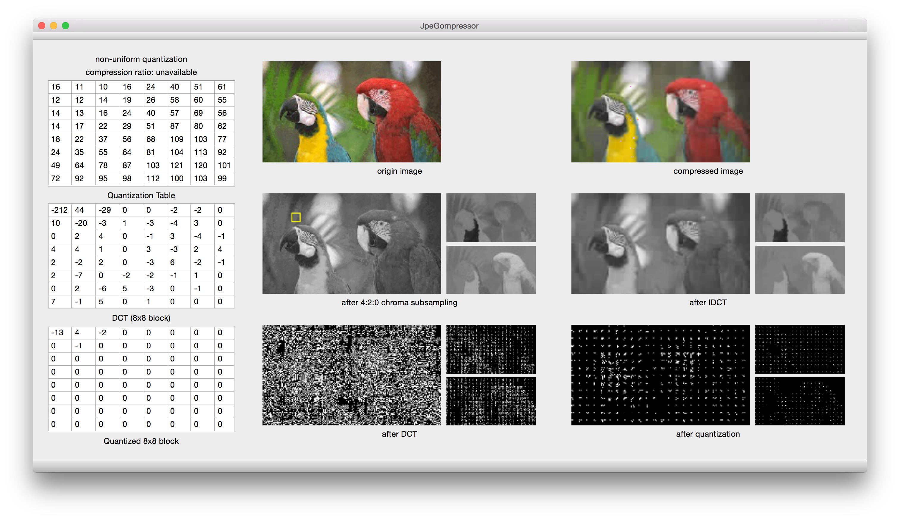
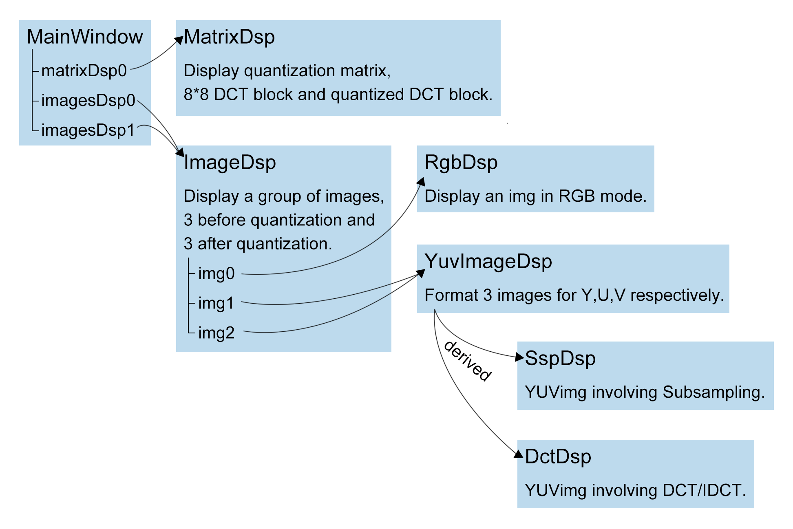
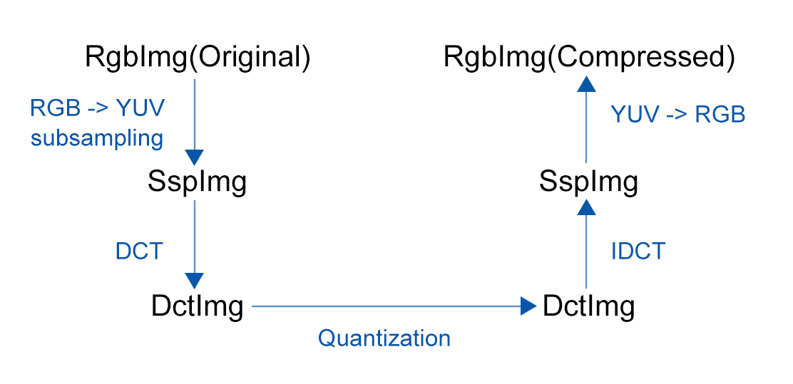
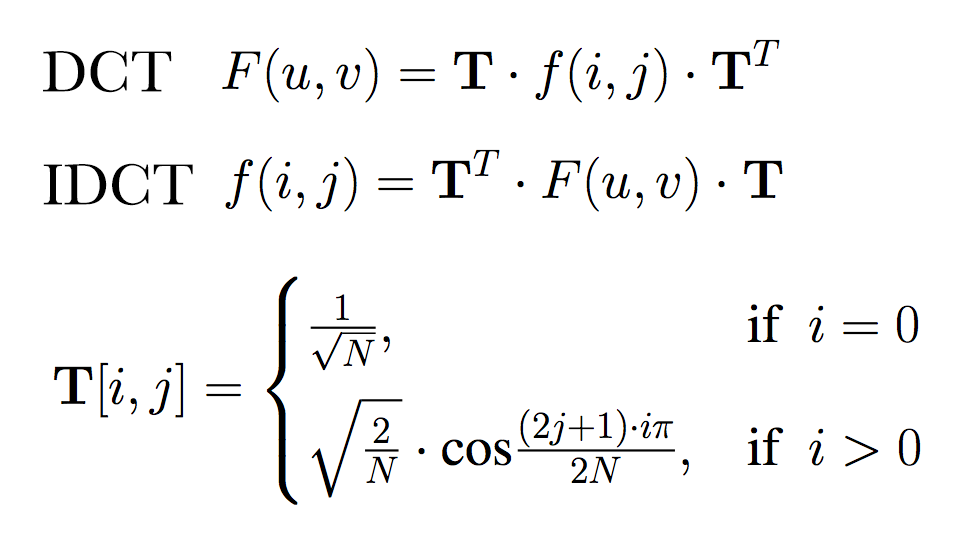

JepGompressor
======================
## Authors
Jingda(Kingston) Chen: 301295759  
Jingmin(Sei) Zhu: 301295748

## Environments:
OX X Yosemite 10.10.5 and higher

##Tools:
C++11  
Qt5.5

## 1 Introduction
JpeGompressor was built to reveal the intermediate steps for the lossy part of JPEG encoding/decoding. The lossy part of JPEG encoding includes:

* __Color model convertion & subsampling__: to convert color from RGB to YCbCr, and do 4:2:0 chroma subsampling, to reduce independent data
* __DCT transformation__: to decompose the original signal into its DC and AC components
* __Quantization__: to reduce the number of distinct output values to a much smaller set

After quantization, the data was further encoded by lossless algorithms and saved into a .jpg file.

On the other hand, when displaying a JPEG encoded image, we need two steps to inverse the lossy part of encoding:

* __IDCT__: to convert DCT transformed data back to YCbCr data
* __color model convertion__: to convert color from YCbCr mode to RGB mode so that colors can be observed.

The JpeGompressor project shows 6 images for an input file: the original image and each result of the above five steps. A preview picture is included as below:

## 2 Features
* JpeGompressor allows users to choose an input file from menu bar: File > Open File
* JpeGompressor allows users to choose from different quantization matrices from menu bar: Quantization Matrix. The chosen matrix is displayed in a table and will be used in the quantization.
* JpeGompressor allows users to pick up a 8x8 pixel block in the subsampling result to see the DCT result of that block as well as the quantization result.

## 3 Implementation
Since object-oriented language is applied, the classes doing the display as well as data process are defined as below:

 Class Defination

Image data are transmitted and processed among classes through the path shown below. Each time an new image file is opened or the quantization matrix is changed, the fellow process will be triggered to generate a new compressed image(Qt signals/slots mechanism is applied here).

 Flow Chart

The data transmission is achieved with the Signal-Slot mechanism provided by Qt. For example, when RgbDsp finishes loading a new image, it emit a signal along with the RGB data as it's parameter. Meanwhile, in SspDsp there's a slot function with the same arguments to do subsampling. In the constructor of MainWindow class, we wrote a connect() command to connect the signal and the slot, so that the slot in SspDsp could receive the signal emitted by RgbDsp, do subsampling, and emit a new signal to DctDsp class for further compression.
### 3.1 RBG & YUV(YCbCr) Convertion
The RGB information of an image is read and converted to the YUV mode.
At last, the generated YUV image will be converted to display the compressed RGB image.

    B = 1.164*(Y-16)                 +1.496*(Cr-128)
    G = 1.164*(Y-16) -0.392*(Cb-128) -0.813*(Cr-128)
    R = 1.164*(Y-16) +2.017*(Cb-128)                
    
    Y  =  0.257*R +0.504*G +0.098*B + 16
    Cb = -0.148*R -0.291*G +0.439*B +128
    Cr =  0.439*R -0.368*G -0.071*B +128

### 3.2 4:2:0 Subsampling
All Y data are reserved. For each 2*2 grid, the Cb data in the first row and first column are reserved and the Cr data in the second row and first column are reserved. Thus we get a 8-bit grayscale image of Y of the original size and those of Cr and Cb of the smaller size(width:original width=height:original height=1:2).

### 3.3 DCT/IDCT

### 3.4 Quantization
F[i,j]=f[i,j]/qm[i,j], F contains the data of the image after quantization, f contains those before quantization and qm are the data in the Quantization Matrix.

### 3.5 Inspecting 8x8 blocks
When clicking on subsampled YUV image, the 8x8 block of data after DCT transformation would be displayed in the matrix, as well as the data after quantization. This feature was implemented by the event handling mechanism in Qt. Clicking on the image triggers a mousePress event, which is detected by an eventFilter function in SspDsp class. In eventFilter function, the mouse press location was obtained. The clicked 8x8 block is picked out and the pixels around this block are set to yellow. Then, the new image with a yellow square is reload and that 8x8 block data is signaled to MatrixDsp class for display.